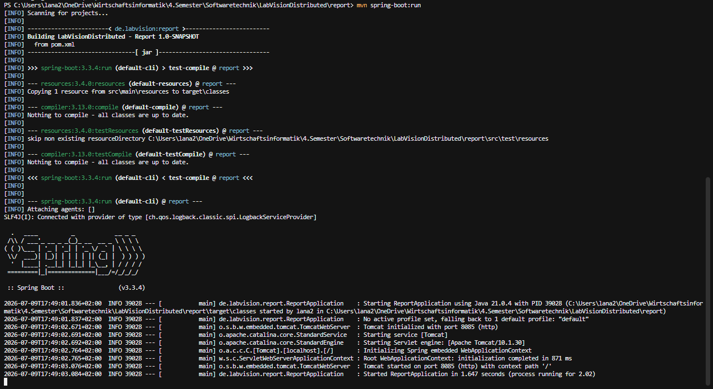
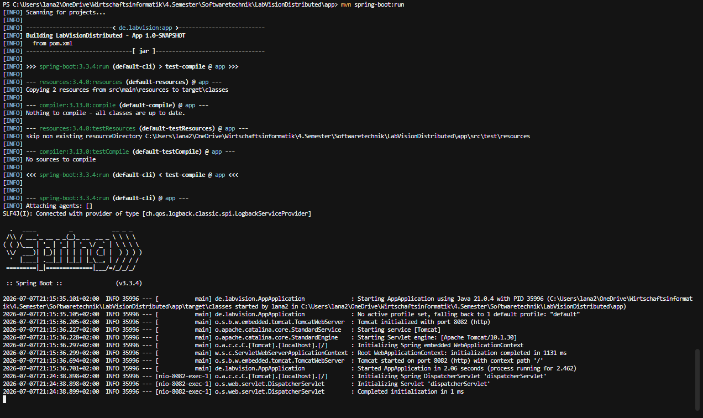
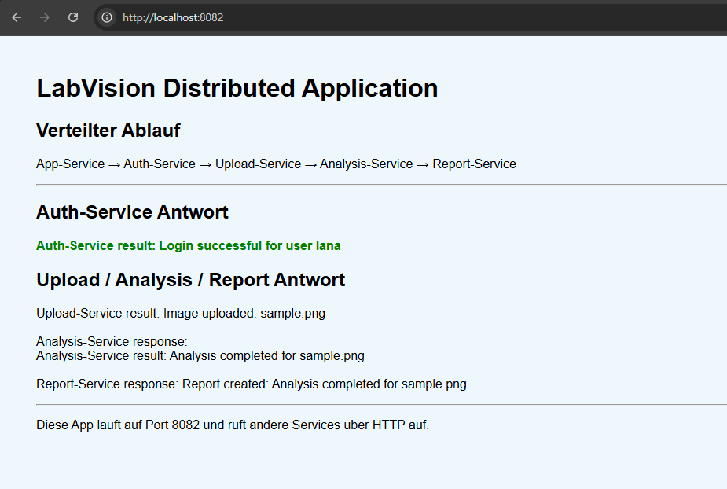

# Projektdokumentation – LabVisionDistributed

## Inhaltsverzeichnis

1. Einleitung
2. Projektarchitektur
   - 2.1 Projektstruktur
3. Beschreibung der Services
   - 3.1 Auth-Service
   - 3.2 Upload-Service
   - 3.3 Analysis-Service
   - 3.4 Report-Service
   - 3.5 App-Service
4. Kommunikation zwischen den Services
5. Starten und Ausführen der Anwendung
6. Fazit
7. Abbildungsverzeichnis

# 1. Einleitung

Im Rahmen des Moduls **Softwaretechnik** wurde das Projekt **LabVisionDistributed** entwickelt. Ziel des Projekts war es, eine bestehende modulare Anwendung in eine verteilte Anwendung umzuwandeln. Dabei sollte gezeigt werden, wie mehrere eigenständige Services zusammenarbeiten und über HTTP miteinander kommunizieren.

Für die Umsetzung wurde die Anwendung in mehrere Spring-Boot-Services aufgeteilt. Jeder Service übernimmt eine klar definierte Aufgabe und läuft als eigener Prozess auf einem eigenen Port. Dadurch können die Services unabhängig voneinander gestartet, getestet und erweitert werden.

Die Anwendung bildet einen einfachen Workflow zur Verarbeitung eines Laborbildes ab. Nach dem Start der Webanwendung erfolgt zunächst die Anmeldung des Benutzers. Anschließend wird der Bildname verarbeitet, analysiert und daraus ein Bericht erstellt. Die Ergebnisse der einzelnen Services werden am Ende in der Webanwendung dargestellt.

Diese Dokumentation beschreibt den Aufbau des Projekts, die Aufgaben der einzelnen Services sowie die Kommunikation zwischen ihnen. Außerdem wird gezeigt, wie die Services gestartet werden und welche Daten während des Workflows zwischen den einzelnen Prozessen übertragen werden.

# 2. Projektarchitektur

## 2.1 Aufbau des Projekts

Die Anwendung wurde als Multi-Modul-Maven-Projekt entwickelt. Dabei ist das Projekt in mehrere Module unterteilt, die jeweils eine eigene Aufgabe übernehmen. Durch diese Struktur bleibt der Quellcode übersichtlich und die einzelnen Module können unabhängig voneinander verwaltet werden.

Für die Umsetzung der verteilten Anwendung wurden fünf eigenständige Spring-Boot-Services erstellt. Jeder Service besitzt eine klar definierte Aufgabe und wird als eigener Prozess gestartet. Zusätzlich enthält das Projekt ein gemeinsames Modul für wiederverwendbare Klassen sowie einen Ordner für die Projektdokumentation.

Die folgende Abbildung zeigt den Aufbau des Projekts in Cursor.

**Abbildung 1: Projektstruktur von LabVisionDistributed**


Die einzelnen Module des Projekts sind in Tabelle 1 beschrieben.

| Modul | Beschreibung |
|--------|--------------|
| **app** | Enthält die Webanwendung und dient als Einstiegspunkt für den Benutzer. |
| **auth** | Enthält den Auth-Service zur Anmeldung des Benutzers. |
| **upload** | Enthält den Upload-Service zur Verarbeitung des Bildnamens. |
| **analysis** | Enthält den Analysis-Service zur Analyse des Bildes. |
| **report** | Enthält den Report-Service zur Erstellung des Berichts. |
| **common** | Enthält gemeinsam genutzte Klassen und Funktionen. |
| **docs** | Enthält die Projektdokumentation sowie die Screenshots. |

Durch diese Aufteilung ist das Projekt klar strukturiert. Änderungen an einem Service können unabhängig von den anderen Modulen vorgenommen werden. Gleichzeitig bleibt der Aufbau der Anwendung leicht verständlich und gut erweiterbar.

# 3. Beschreibung der Services

Die Anwendung besteht aus fünf eigenständigen Spring-Boot-Services. Jeder Service übernimmt eine klar definierte Aufgabe innerhalb des Workflows. Durch diese Aufteilung bleibt die Anwendung übersichtlich und einzelne Funktionen können unabhängig voneinander entwickelt, gestartet und getestet werden.

Im Folgenden werden die einzelnen Services und ihre Aufgaben beschrieben.

## 3.1 Auth-Service

Der Auth-Service ist für die Anmeldung des Benutzers verantwortlich und bildet den ersten Schritt des Workflows. Nach dem Aufruf der Webanwendung erhält der Service den Benutzernamen und das Passwort und überprüft die Anmeldedaten.

Für dieses Projekt wurde die Anmeldung bewusst einfach umgesetzt. Es wird keine Datenbank verwendet, da der Schwerpunkt auf der verteilten Architektur und der Kommunikation zwischen den Services liegt.

Der Auth-Service läuft auf **Port 8081**.

**Aufgaben des Auth-Services**

- Entgegennahme des Benutzernamens und Passworts
- Überprüfung der Anmeldedaten
- Rückgabe des Login-Ergebnisses an den App-Service

---

## 3.2 Upload-Service

Der Upload-Service übernimmt den Upload-Schritt der Anwendung. In diesem Projekt wird kein echtes Bild hochgeladen. Stattdessen wird beispielhaft der Bildname **sample.png** verwendet.

Der Service empfängt den Bildnamen und bereitet ihn für den nächsten Verarbeitungsschritt vor. Dadurch wird der Upload als eigener Service von den übrigen Funktionen der Anwendung getrennt.

Der Upload-Service läuft auf **Port 8083**.

**Aufgaben des Upload-Services**

- Entgegennahme des Bildnamens
- Verarbeitung des Uploads
- Übergabe der Bildinformationen an den Analysis-Service

---

## 3.3 Analysis-Service

Der Analysis-Service übernimmt die Analyse des übergebenen Bildes. Nach dem Empfang des Bildnamens wird die Analyse durchgeführt und ein Analyseergebnis erzeugt.

Die eigentliche Bildanalyse wurde in diesem Projekt bewusst vereinfacht umgesetzt. Ziel ist es, den Ablauf einer verteilten Anwendung darzustellen und zu zeigen, wie die Verarbeitung in einen eigenen Service ausgelagert werden kann.

Der Analysis-Service läuft auf **Port 8084**.

**Aufgaben des Analysis-Services**

- Empfang des Bildnamens
- Durchführung der Analyse
- Erstellung eines Analyseergebnisses
- Übergabe des Analyseergebnisses an den Report-Service

---

## 3.4 Report-Service

Der Report-Service bildet den letzten Verarbeitungsschritt der Anwendung. Er empfängt das Analyseergebnis und erstellt daraus einen Bericht.

Auch dieser Service wurde bewusst einfach umgesetzt. Im Mittelpunkt steht die Trennung der einzelnen Aufgaben auf mehrere unabhängige Services.

Der Report-Service läuft auf **Port 8085**.

**Aufgaben des Report-Services**

- Empfang des Analyseergebnisses
- Erstellung eines Berichts
- Rückgabe des Berichts an den App-Service

---

## 3.5 App-Service

Der App-Service stellt die Weboberfläche der Anwendung bereit und dient als Einstiegspunkt für den Benutzer. Er koordiniert den gesamten Workflow und ruft die einzelnen Services in der richtigen Reihenfolge auf.

Nachdem die Antworten der einzelnen Services empfangen wurden, werden die Ergebnisse gesammelt und in der Weboberfläche dargestellt. Dadurch erhält der Benutzer eine übersichtliche Darstellung des gesamten Ablaufs.

Der App-Service läuft auf **Port 8082**.

**Aufgaben des App-Services**

- Bereitstellung der Weboberfläche
- Starten des Workflows
- Aufruf der einzelnen Services
- Entgegennahme der Antworten
- Darstellung der Ergebnisse im Browser

# 4. Kommunikation zwischen den Services

Die einzelnen Services kommunizieren über HTTP-Anfragen miteinander. Jeder Service besitzt einen eigenen Port und übernimmt eine klar definierte Aufgabe innerhalb des Workflows. Nachdem ein Service seine Aufgabe abgeschlossen hat, wird das Ergebnis an den nächsten Service weitergegeben. Dadurch arbeiten alle Services zusammen, obwohl sie als eigenständige Prozesse ausgeführt werden.

Die folgende Abbildung zeigt den Ablauf der Kommunikation zwischen den einzelnen Services.

**Abbildung 7: Kommunikationsablauf der Anwendung**

*(Hier wird das Architekturdiagramm eingefügt.)*

## 4.1 Ablauf der Kommunikation

Der Benutzer startet den Workflow über die Webanwendung. Der App-Service übernimmt die Steuerung und ruft die einzelnen Services nacheinander auf. Jeder Service verarbeitet die empfangenen Daten und gibt das Ergebnis an den nächsten Service weiter.

Der Ablauf erfolgt in der folgenden Reihenfolge:

```
Browser
   │
   ▼
App-Service (8082)
   │
   ▼
Auth-Service (8081)
   │
   ▼
Upload-Service (8083)
   │
   ▼
Analysis-Service (8084)
   │
   ▼
Report-Service (8085)
   │
   ▼
Browser
```

## 4.2 Datenaustausch zwischen den Services

Die folgende Tabelle zeigt, welche Informationen zwischen den einzelnen Services übertragen werden.

| Schritt | Kommunikation | Übertragene Daten |
|----------|---------------|-------------------|
| 1 | App-Service → Auth-Service | Benutzername und Passwort |
| 2 | App-Service → Upload-Service | Bildname (`sample.png`) |
| 3 | Upload-Service → Analysis-Service | Bildname |
| 4 | Analysis-Service → Report-Service | Analyseergebnis |
| 5 | Report-Service → App-Service | Fertiger Bericht |

## 4.3 HTTP-Aufrufe

Die Kommunikation erfolgt über HTTP-GET-Anfragen. Jeder Service besitzt eine eigene URL und einen eigenen Port.

### Auth-Service

```
GET http://localhost:8081/login?username=lana&password=password
```

Antwort:

```
Login successful for user lana
```

---

### Upload-Service

```
GET http://localhost:8083/upload?imageName=sample.png
```

Antwort:

```
Image uploaded: sample.png
```

---

### Analysis-Service

```
GET http://localhost:8084/analysis?imageName=sample.png
```

Antwort:

```
Analysis completed for sample.png
```

---

### Report-Service

```
GET http://localhost:8085/report?analysisResult=Analysis completed for sample.png
```

Antwort:

```
Report created: Analysis completed for sample.png
```

## 4.4 Bedeutung der Ports

Jeder Service läuft auf einem eigenen Port. Dadurch kann jeder Service unabhängig gestartet und ausgeführt werden.

| Service | Port |
|----------|------|
| Auth-Service | 8081 |
| App-Service | 8082 |
| Upload-Service | 8083 |
| Analysis-Service | 8084 |
| Report-Service | 8085 |

Die Verwendung unterschiedlicher Ports zeigt, dass die Anwendung nicht aus einem einzigen Programm besteht. Stattdessen kommunizieren mehrere unabhängige Prozesse über HTTP miteinander. Genau dieses Prinzip bildet die Grundlage einer verteilten Anwendung.

# 5. Starten und Ausführen der Anwendung

Vor der Ausführung der Anwendung müssen alle Services einzeln gestartet werden. Jeder Service wird in einem eigenen Terminal mit dem Befehl `mvn spring-boot:run` gestartet. Da jeder Service als eigenständiger Spring-Boot-Prozess ausgeführt wird, können die Services unabhängig voneinander gestartet oder beendet werden.

Die folgende Reihenfolge wurde beim Start der Anwendung verwendet:

1. Auth-Service
2. Upload-Service
3. Analysis-Service
4. Report-Service
5. App-Service

Die Abbildungen 8 bis 12 zeigen die erfolgreich gestarteten Services.

### Abbildung 8: Gestarteter Auth-Service


Der Auth-Service wurde erfolgreich gestartet und wartet auf eingehende Anfragen auf Port 8081.

---

### Abbildung 9: Gestarteter Upload-Service


Der Upload-Service wurde erfolgreich gestartet und läuft auf Port 8083.

---

### Abbildung 10: Gestarteter Analysis-Service


Der Analysis-Service wurde erfolgreich gestartet und läuft auf Port 8084.

---

### Abbildung 11: Gestarteter Report-Service



Der Report-Service wurde erfolgreich gestartet und läuft auf Port 8085.

---

### Abbildung 12: Gestarteter App-Service



Der App-Service wurde erfolgreich gestartet und stellt die Webanwendung auf Port 8082 bereit.

## 5.1 Ausführung der Anwendung

Nachdem alle Services gestartet wurden, kann die Anwendung über den Browser aufgerufen werden.

```
http://localhost:8082
```

Nach dem Aufruf der Webanwendung wird der vollständige Workflow automatisch ausgeführt. Die Ergebnisse der einzelnen Services werden anschließend in der Benutzeroberfläche angezeigt.

**Abbildung 13: Ausführung der Anwendung im Browser**



Die Abbildung zeigt die fertige Webanwendung. Nach der erfolgreichen Anmeldung werden der Upload, die Analyse und die Berichterstellung durchgeführt. Die Antworten der einzelnen Services werden anschließend gesammelt und in der Weboberfläche dargestellt.

# 6. Fazit

Im Rahmen dieses Projekts wurde eine modulare Anwendung erfolgreich in eine verteilte Anwendung umgewandelt. Die einzelnen Funktionen wurden in eigenständige Spring-Boot-Services aufgeteilt, die unabhängig voneinander gestartet werden können und über HTTP miteinander kommunizieren.

Durch die Aufteilung in mehrere Services ist die Struktur der Anwendung übersichtlich und leicht nachvollziehbar. Jeder Service übernimmt eine klar definierte Aufgabe, wodurch Änderungen oder Erweiterungen einfacher umgesetzt werden können.

Die Dokumentation zeigt den Aufbau der Anwendung, die Aufgaben der einzelnen Services sowie den Datenaustausch zwischen den Prozessen. Anhand der Screenshots und der beschriebenen HTTP-Kommunikation wird deutlich, dass die Anwendung aus mehreren unabhängigen Prozessen besteht und damit die grundlegenden Merkmale einer verteilten Anwendung erfüllt.

Das Projekt vermittelt die wichtigsten Grundlagen verteilter Systeme und bildet eine gute Basis für zukünftige Erweiterungen, beispielsweise durch zusätzliche Services oder komplexere Kommunikationsmechanismen.
