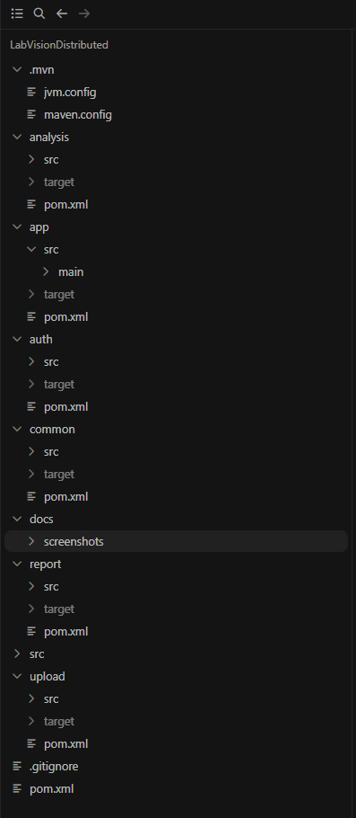
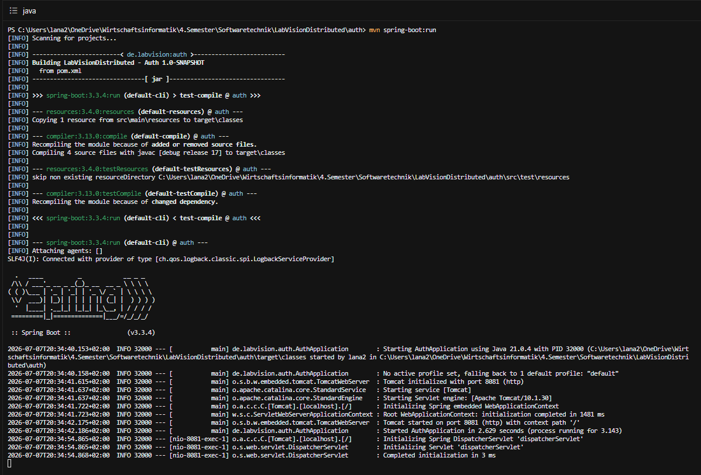
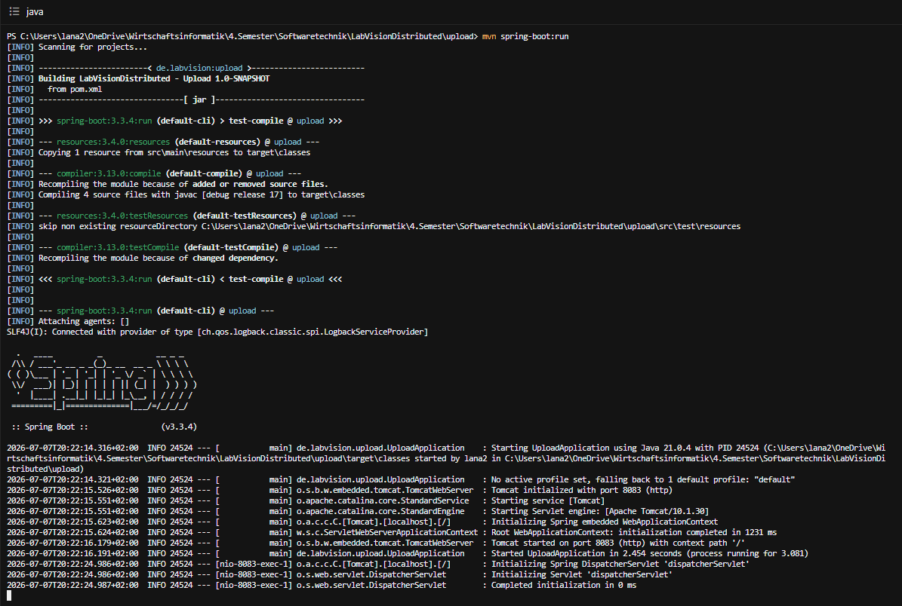
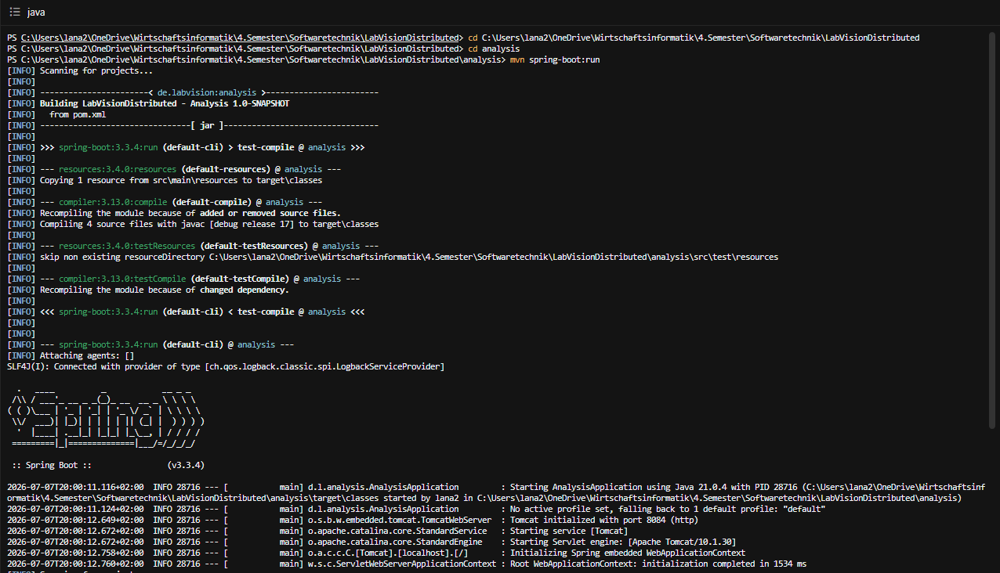

# Projektdokumentation – LabVisionDistributed

## 1. Einleitung

LabVisionDistributed ist eine verteilte Anwendung, die im Rahmen des Moduls Softwaretechnik entwickelt wurde. Ziel der Dokumentation ist es zu zeigen, wie die einzelnen Services gestartet werden, wie sie unabhängig voneinander laufen und welche Daten über die verschiedenen Ports ausgetauscht werden.

Die Anwendung besteht aus mehreren eigenständigen Spring-Boot-Services. Jeder Service übernimmt eine bestimmte Aufgabe und läuft als eigener Prozess. Die Kommunikation zwischen den Services erfolgt über HTTP-Anfragen.

Dadurch wird das Prinzip einer verteilten Anwendung praktisch dargestellt.
---

# 2. Projektarchitektur

Die Anwendung wurde als **Multi-Modul-Maven-Projekt** entwickelt. Das bedeutet, dass das Projekt aus mehreren Modulen besteht, die jeweils eine eigene Aufgabe übernehmen. Durch diese Aufteilung bleibt der Quellcode übersichtlich und die einzelnen Teile der Anwendung können unabhängig voneinander entwickelt werden.

Für die verteilte Anwendung wurden fünf eigenständige Spring-Boot-Services erstellt. Jeder Service wird als eigener Prozess gestartet und läuft auf einem eigenen Port. Dadurch können die Services unabhängig voneinander ausgeführt werden. Die Kommunikation zwischen den Services erfolgt ausschließlich über HTTP-Anfragen.

Die folgende Abbildung zeigt die Struktur des Projekts.

**Abbildung 1: Projektstruktur von LabVisionDistributed**

Die wichtigsten Module des Projekts sind in der folgenden Tabelle dargestellt.

| Modul | Aufgabe |
|--------|----------|
| **app** | Stellt die Webanwendung bereit und steuert den gesamten Ablauf der Anwendung. |
| **auth** | Überprüft die Anmeldedaten des Benutzers. |
| **upload** | Nimmt den Bildnamen entgegen und leitet ihn an den Analysis-Service weiter. |
| **analysis** | Analysiert das Bild und erstellt das Analyseergebnis. |
| **report** | Erstellt aus dem Analyseergebnis den Bericht. |
| **common** | Enthält gemeinsam genutzte Klassen, die von mehreren Modulen verwendet werden. |
| **docs** | Enthält die Projektdokumentation und die Screenshots. |

Die Kommunikation zwischen den Services erfolgt über das HTTP-Protokoll. Jeder Service besitzt einen eigenen Port und kann unabhängig von den anderen Services gestartet oder beendet werden. Dadurch wird das Prinzip einer verteilten Anwendung umgesetzt.
---

# 3. Beschreibung der Services

Die Anwendung besteht aus fünf eigenständigen Spring-Boot-Services. Jeder Service übernimmt eine bestimmte Aufgabe innerhalb des gesamten Workflows. Durch diese Aufteilung können die Services unabhängig voneinander gestartet, ausgeführt und getestet werden.

Im Folgenden werden die einzelnen Services mit ihrer Aufgabe, ihrem Port und ihrer Kommunikation beschrieben.

## 3.1 Auth-Service

Der Auth-Service ist für die Anmeldung des Benutzers verantwortlich. Er ist der erste Service, der nach dem Start der Webanwendung aufgerufen wird. Die Webanwendung sendet den Benutzernamen und das Passwort an den Auth-Service. Dieser überprüft die Anmeldedaten und gibt anschließend eine Antwort an die Webanwendung zurück.

Der Auth-Service läuft auf **Port 8081** und kommuniziert über HTTP mit dem App-Service.

### Empfangene Daten

- Benutzername
- Passwort

### Antwort

- Login erfolgreich
- Login fehlgeschlagen

**Abbildung 2: Gestarteter Auth-Service**

Der Screenshot zeigt den gestarteten Auth-Service. Er wird als eigenständiger Spring-Boot-Prozess ausgeführt und wartet auf eingehende HTTP-Anfragen der Webanwendung.

## 3.2 Upload-Service

Der Upload-Service ist für die Verarbeitung des Bilduploads zuständig. Nachdem der Benutzer erfolgreich angemeldet wurde, übergibt die Webanwendung den Namen des Bildes an den Upload-Service. In diesem Projekt wird kein echtes Bild hochgeladen, sondern beispielhaft der Bildname **sample.png** verwendet.

Der Upload-Service empfängt den Bildnamen und leitet ihn anschließend über eine HTTP-Anfrage an den Analysis-Service weiter. Dadurch übernimmt der Upload-Service die Rolle einer Schnittstelle zwischen der Webanwendung und der Bildanalyse.

Der Upload-Service läuft auf **Port 8083**.

### Empfangene Daten

- Bildname (z. B. `sample.png`)

### Weitergeleitete Daten

- Bildname an den Analysis-Service

**Abbildung 3: Gestarteter Upload-Service**

Der Screenshot zeigt den gestarteten Upload-Service. Er läuft als eigenständiger Spring-Boot-Prozess auf Port 8083 und wartet auf HTTP-Anfragen der Webanwendung. Nach dem Empfang des Bildnamens wird dieser an den Analysis-Service weitergeleitet.

## 3.3 Analysis-Service

Der Analysis-Service übernimmt die Analyse des hochgeladenen Bildes. Nachdem der Upload-Service den Bildnamen übermittelt hat, empfängt der Analysis-Service diese Information und führt die Analyse durch.

In diesem Projekt wird die Analyse beispielhaft dargestellt. Der Service verarbeitet den Bildnamen und erstellt ein Analyseergebnis. Anschließend wird dieses Ergebnis über eine HTTP-Anfrage an den Report-Service weitergeleitet.

Der Analysis-Service läuft auf **Port 8084**.

### Empfangene Daten

- Bildname (z. B. `sample.png`)

### Weitergeleitete Daten

- Analyseergebnis

**Abbildung 4: Gestarteter Analysis-Service**

Der Screenshot zeigt den gestarteten Analysis-Service. Er läuft als eigenständiger Spring-Boot-Prozess auf Port 8084 und wartet auf HTTP-Anfragen des Upload-Service. Nach der Verarbeitung des Bildnamens wird das Analyseergebnis an den Report-Service weitergegeben.
