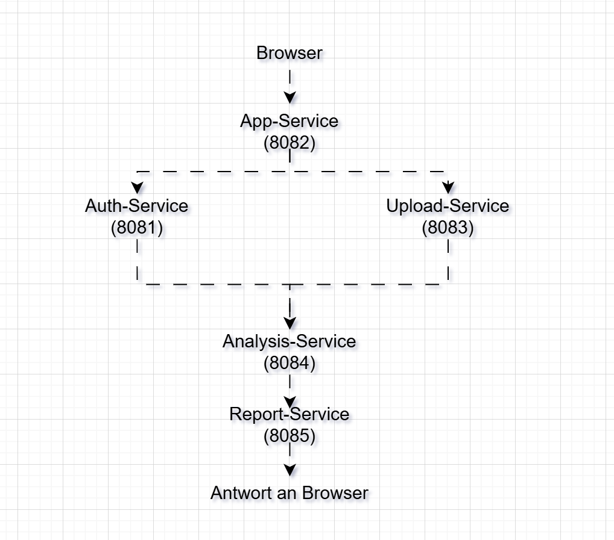

# Projektdokumentation – LabVisionDistributed

## Inhaltsverzeichnis

1. Einleitung
2. Projektarchitektur
   - 2.1 Projektstruktur
3. Beschreibung der Services
   - 3.1 Auth-Service
   - 3.2 Upload-Service
   - 3.3 Analysis-Service
   - 3.4 Report-Service
   - 3.5 App-Service
4. Kommunikation zwischen den Services
5. Starten und Ausführen der Anwendung
6. Fazit
7. Abbildungsverzeichnis

# 1. Einleitung

Im Rahmen des Moduls **Softwaretechnik** bestand die Aufgabe darin, eine modulare Anwendung in eine verteilte Anwendung umzuwandeln. Für mein Projekt habe ich mich für das Thema **LabVisionDistributed** entschieden.

Die Idee für dieses Projekt entstand, weil ich zwei verschiedene Fachbereiche miteinander verbinden wollte. Ich studiere **Pharma- und Chemietechnik**, während meine Schwester **Informatik** studiert. Gemeinsam haben wir überlegt, wie sich Inhalte aus beiden Studiengängen in einem Projekt kombinieren lassen. Daraus entstand die Idee einer Anwendung zur Verarbeitung von Laborbildern, bei der die Softwarearchitektur im Mittelpunkt steht.

Das Projekt simuliert einen einfachen Ablauf aus einem Labor. Nach der Anmeldung wird ein Bild verarbeitet, analysiert und anschließend ein Bericht erstellt. Dabei steht nicht die eigentliche Bildanalyse im Vordergrund, sondern die Umsetzung einer verteilten Architektur. Ziel war es, den gesamten Workflow auf mehrere eigenständige Spring-Boot-Services aufzuteilen, die über HTTP miteinander kommunizieren.

Während der Entwicklung war es mir wichtig, nicht nur die technischen Anforderungen der Aufgabe umzusetzen, sondern auch ein Projekt zu erstellen, das einen Bezug zu meinem eigenen Studium hat. Gleichzeitig konnte ich Ideen aus dem Informatikstudium meiner Schwester aufgreifen und besser verstehen, wie verteilte Anwendungen aufgebaut sind.

In dieser Dokumentation werden zunächst der Aufbau des Projekts und die einzelnen Services beschrieben. Anschließend wird erklärt, wie die Services miteinander kommunizieren, welche Daten zwischen ihnen ausgetauscht werden und wie die Anwendung gestartet und ausgeführt wird.

# 2. Projektarchitektur

Nachdem die Idee für das Projekt feststand, habe ich mir zunächst überlegt, wie sich der Workflow sinnvoll in mehrere eigenständige Services aufteilen lässt. Mir war wichtig, dass jeder Service nur eine Aufgabe übernimmt und der gesamte Ablauf trotzdem leicht verständlich bleibt.

Aus diesem Grund habe ich mich für eine Multi-Modul-Struktur mit Spring Boot entschieden. Jedes Modul bildet einen eigenen Service und kann unabhängig von den anderen gestartet werden. Dadurch entspricht der Aufbau einer verteilten Anwendung und nicht mehr einer klassischen Anwendung, in der alle Funktionen in einem einzigen Programm enthalten sind.

Die folgende Abbildung zeigt den Aufbau des Projekts.

**Abbildung 1: Projektstruktur von LabVisionDistributed**


Die einzelnen Module übernehmen unterschiedliche Aufgaben.

| Modul | Beschreibung |
|--------|--------------|
| **app** | Enthält die Webanwendung und dient als Einstiegspunkt für den Benutzer. |
| **auth** | Übernimmt die Anmeldung des Benutzers. |
| **upload** | Verarbeitet den Bildnamen und startet den Upload-Schritt. |
| **analysis** | Führt die Analyse des Bildes durch. |
| **report** | Erstellt den Bericht aus dem Analyseergebnis. |
| **common** | Enthält gemeinsam genutzte Klassen und Funktionen. |
| **docs** | Enthält die Projektdokumentation und alle Screenshots. |

Bei der Entwicklung habe ich bewusst darauf geachtet, dass jedes Modul möglichst unabhängig arbeitet. Dadurch bleibt der Quellcode übersichtlich und einzelne Services können später einfacher erweitert oder ausgetauscht werden.

# 3. Beschreibung der Services

Nachdem die Projektstruktur feststand, habe ich die Anwendung in mehrere eigenständige Services aufgeteilt. Mir war wichtig, dass jeder Service nur eine klar definierte Aufgabe übernimmt. Dadurch bleibt der Aufbau übersichtlich und der gesamte Workflow lässt sich leichter nachvollziehen.

Anstatt alle Funktionen in einer einzigen Anwendung zu bündeln, arbeitet jeder Service unabhängig und übernimmt genau einen Teil des Ablaufs. Dieses Prinzip findet man auch in vielen modernen Softwaresystemen und war ein wichtiger Bestandteil dieser Projektarbeit.

Im Folgenden werden die einzelnen Services näher beschrieben.

---

## 3.1 Auth-Service

Der Auth-Service bildet den ersten Schritt des gesamten Workflows. Seine Aufgabe besteht darin, die Anmeldung des Benutzers zu überprüfen. Sobald die Webanwendung gestartet wird, werden der Benutzername und das Passwort an diesen Service übergeben.

Da der Schwerpunkt dieses Projekts auf der verteilten Architektur liegt, habe ich bewusst auf eine Datenbank oder eine umfangreiche Benutzerverwaltung verzichtet. Stattdessen sollte der Auth-Service zeigen, wie ein eigener Service Anfragen entgegennimmt, verarbeitet und eine Antwort zurückgibt.

Der Auth-Service läuft auf **Port 8081**.

**Aufgaben des Auth-Services**

- Anmeldung des Benutzers prüfen
- Benutzername und Passwort verarbeiten
- Ergebnis der Anmeldung zurückgeben

---

## 3.2 Upload-Service

Nach einer erfolgreichen Anmeldung übernimmt der Upload-Service den nächsten Schritt des Workflows. Seine Aufgabe besteht darin, den Bildnamen entgegenzunehmen.

Da es in dieser Projektarbeit nicht um die Entwicklung einer echten Bildverwaltung ging, habe ich mich dafür entschieden, den Upload zu vereinfachen. Statt einer Bilddatei wird lediglich der Name des Bildes verarbeitet. Dadurch bleibt der Fokus auf der Kommunikation zwischen den einzelnen Services.

Der Upload-Service läuft auf **Port 8083**.

**Aufgaben des Upload-Services**

- Bildnamen entgegennehmen
- Upload-Schritt verarbeiten
- Bildinformationen für den nächsten Verarbeitungsschritt bereitstellen

---

## 3.3 Analysis-Service

Der Analysis-Service stellt den eigentlichen Kern des Workflows dar. Nachdem der Bildname übergeben wurde, wird eine Analyse durchgeführt und ein Analyseergebnis erstellt.

Auch dieser Service wurde bewusst einfach umgesetzt. Für mich stand nicht die Entwicklung einer komplexen Bildanalyse im Vordergrund, sondern die Frage, wie sich eine Verarbeitung sinnvoll in einen eigenen Service auslagern lässt.

Der Analysis-Service läuft auf **Port 8084**.

**Aufgaben des Analysis-Services**

- Bildnamen verarbeiten
- Analyse durchführen
- Analyseergebnis erzeugen

---

## 3.4 Report-Service

Nachdem die Analyse abgeschlossen wurde, übernimmt der Report-Service den letzten Verarbeitungsschritt. Er erstellt aus dem Analyseergebnis einen Bericht, der später in der Webanwendung angezeigt wird.

Auch hier war mein Ziel nicht die Entwicklung eines umfangreichen Berichtssystems. Viel wichtiger war es, den gesamten Workflow durch einen weiteren eigenständigen Service zu vervollständigen und den Datenaustausch zwischen den einzelnen Prozessen sichtbar zu machen.

Der Report-Service läuft auf **Port 8085**.

**Aufgaben des Report-Services**

- Analyseergebnis entgegennehmen
- Bericht erstellen
- Bericht an die Webanwendung zurückgeben

---

## 3.5 App-Service

Der App-Service verbindet alle anderen Services miteinander und bildet den Einstiegspunkt der Anwendung. Über ihn wird die Weboberfläche bereitgestellt, die der Benutzer im Browser aufruft.

Ich habe mich bewusst dafür entschieden, dass der App-Service selbst keine fachlichen Aufgaben übernimmt. Stattdessen koordiniert er den gesamten Ablauf und ruft die einzelnen Services nacheinander auf. Dadurch bleibt die Verantwortung der einzelnen Services klar voneinander getrennt.

Der App-Service läuft auf **Port 8082**.

**Aufgaben des App-Services**

- Bereitstellung der Weboberfläche
- Start des gesamten Workflows
- Aufruf der einzelnen Services
- Anzeige der Ergebnisse im Browser

# 4. Kommunikation zwischen den Services

Nachdem alle Services entwickelt waren, bestand die eigentliche Herausforderung darin, sie miteinander kommunizieren zu lassen. Da jeder Service als eigener Spring-Boot-Prozess läuft, können Informationen nicht einfach über Methoden oder gemeinsame Klassen ausgetauscht werden. Stattdessen erfolgt die gesamte Kommunikation über HTTP-Anfragen.

Genau dieser Punkt unterscheidet eine verteilte Anwendung von einer klassischen Anwendung. Jeder Service arbeitet unabhängig und kennt nur seine eigene Aufgabe. Erst durch den Austausch der Daten über HTTP entsteht der vollständige Workflow.

Mir war dabei wichtig, dass jeder Service möglichst wenig Verantwortung übernimmt. Jeder Service verarbeitet nur die Daten, die er für seine Aufgabe benötigt, und gibt anschließend das Ergebnis an den nächsten Service weiter. Dadurch bleibt die Anwendung übersichtlich und einzelne Services können später leichter erweitert oder ausgetauscht werden.

## 4.1 Ablauf des Workflows

Der gesamte Workflow beginnt mit dem Aufruf der Webanwendung im Browser. Von dort aus startet der App-Service alle weiteren Schritte und ruft die einzelnen Services nacheinander auf.

Der Ablauf sieht folgendermaßen aus:

```text
Browser
   │
   ▼
App-Service (8082)
   │
   ▼
Auth-Service (8081)
   │
   ▼
Upload-Service (8083)
   │
   ▼
Analysis-Service (8084)
   │
   ▼
Report-Service (8085)
   │
   ▼
Browser
```

**Abbildung 7: Kommunikationsablauf der Anwendung**



## 4.2 Kommunikation über HTTP

Die Kommunikation erfolgt vollständig über HTTP. Jeder Service besitzt eine eigene URL und einen eigenen Port. Sobald ein Service seine Aufgabe abgeschlossen hat, wird das Ergebnis an den nächsten Service weitergegeben.

Die folgende Tabelle zeigt, welche Daten zwischen den einzelnen Services übertragen werden.

| Schritt | Sender | Empfänger | Übertragene Daten |
|----------|---------|-----------|-------------------|
| 1 | App-Service | Auth-Service | Benutzername und Passwort |
| 2 | App-Service | Upload-Service | Bildname (`sample.png`) |
| 3 | Upload-Service | Analysis-Service | Bildname |
| 4 | Analysis-Service | Report-Service | Analyseergebnis |
| 5 | Report-Service | App-Service | Fertiger Bericht |

## 4.3 Beispiel eines HTTP-Aufrufs

Die Kommunikation wird in meinem Projekt über HTTP-GET-Anfragen umgesetzt. Ein Beispiel ist die Anmeldung beim Auth-Service.

```text
GET http://localhost:8081/login?username=lana&password=password
```

Der Auth-Service verarbeitet die Anfrage und gibt anschließend folgende Antwort zurück:

```text
Login successful for user lana
```

Nach dem gleichen Prinzip arbeiten auch die übrigen Services. Jeder Service empfängt Daten, verarbeitet sie und sendet anschließend eine Antwort zurück.

## 4.4 Verwendete Ports

Jeder Service besitzt einen eigenen Port. Dadurch können alle Services gleichzeitig ausgeführt werden, ohne sich gegenseitig zu beeinflussen.

| Service | Port |
|----------|------|
| Auth-Service | 8081 |
| App-Service | 8082 |
| Upload-Service | 8083 |
| Analysis-Service | 8084 |
| Report-Service | 8085 |

Die unterschiedlichen Ports zeigen, dass die Anwendung aus mehreren unabhängigen Prozessen besteht. Jeder Service kann einzeln gestartet, getestet oder beendet werden, ohne dass der Quellcode der anderen Services verändert werden muss.

# 5. Starten und Ausführen der Anwendung

Nachdem alle Services entwickelt und miteinander verbunden waren, konnte die Anwendung getestet werden. Dafür musste zunächst jeder Service einzeln gestartet werden. Genau dieser Schritt zeigt den Unterschied zwischen einer klassischen Anwendung und einer verteilten Anwendung. Anstatt nur ein Programm zu starten, werden mehrere eigenständige Prozesse ausgeführt, die später über HTTP zusammenarbeiten.

Zum Starten der Services habe ich für jedes Modul ein eigenes Terminal geöffnet und den folgenden Maven-Befehl verwendet:

```bash
mvn spring-boot:run
```

Die Services wurden in folgender Reihenfolge gestartet:

1. Auth-Service (Port 8081)
2. Upload-Service (Port 8083)
3. Analysis-Service (Port 8084)
4. Report-Service (Port 8085)
5. App-Service (Port 8082)

Die folgenden Abbildungen zeigen die erfolgreich gestarteten Services.

### Abbildung 8: Auth-Service


Der Auth-Service wurde erfolgreich gestartet und wartet auf Anfragen auf Port 8081.

---

### Abbildung 9: Upload-Service


Der Upload-Service läuft auf Port 8083 und ist bereit, den Bildnamen zu verarbeiten.

---

### Abbildung 10: Analysis-Service


Der Analysis-Service wurde erfolgreich gestartet und verarbeitet später den Bildnamen.

---

### Abbildung 11: Report-Service


Der Report-Service läuft auf Port 8085 und erstellt den Bericht aus dem Analyseergebnis.

---

### Abbildung 12: App-Service


Der App-Service wurde zuletzt gestartet und stellt die Webanwendung auf Port 8082 bereit.

## 5.1 Ausführung im Browser

Nachdem alle Services erfolgreich gestartet waren, konnte die Anwendung im Browser geöffnet werden.

```
http://localhost:8082
```

Beim Aufruf der Seite startet der komplette Workflow automatisch. Die Webanwendung ruft nacheinander die einzelnen Services auf und zeigt die Ergebnisse anschließend übersichtlich im Browser an.

**Abbildung 13: Ausführung der Anwendung**


Die Abbildung zeigt den erfolgreichen Ablauf der Anwendung. Zunächst wird die Anmeldung durchgeführt. Anschließend folgen der Upload des Bildnamens, die Analyse und schließlich die Erstellung des Berichts. Die Ergebnisse aller Services werden am Ende in der Weboberfläche angezeigt.

Während der Tests konnte ich gut nachvollziehen, wie die einzelnen Services zusammenarbeiten. Obwohl jeder Service als eigener Prozess läuft, entsteht durch die HTTP-Kommunikation ein durchgängiger Workflow. Genau dieses Zusammenspiel macht den Unterschied zwischen einer modularen und einer verteilten Anwendung deutlich.

# 6. Fazit

Mit diesem Projekt konnte ich mein Wissen aus dem Modul Softwaretechnik praktisch anwenden und gleichzeitig eine Verbindung zu meinem eigenen Studium herstellen. Da ich Pharma- und Chemietechnik studiere und meine Schwester Informatik studiert, fand ich die Idee spannend, beide Fachrichtungen in einem gemeinsamen Projekt miteinander zu verbinden.

Während der Entwicklung habe ich nicht nur gelernt, wie mehrere Spring-Boot-Services aufgebaut werden, sondern vor allem, wie sie über HTTP miteinander kommunizieren und als eigenständige Prozesse zusammenarbeiten. Besonders interessant war für mich zu sehen, wie aus mehreren kleinen Services eine vollständige Anwendung entsteht.

Rückblickend hat mir das Projekt geholfen, das Konzept verteilter Systeme deutlich besser zu verstehen. Gleichzeitig konnte ich praktische Erfahrungen mit Spring Boot, Maven und der Kommunikation über HTTP sammeln.

Ich bin mit dem Ergebnis zufrieden, da alle Services erfolgreich zusammenarbeiten und die Anforderungen der Aufgabenstellung umgesetzt wurden. Das Projekt bietet außerdem eine gute Grundlage, um die Anwendung in Zukunft um weitere Funktionen oder zusätzliche Services zu erweitern.
